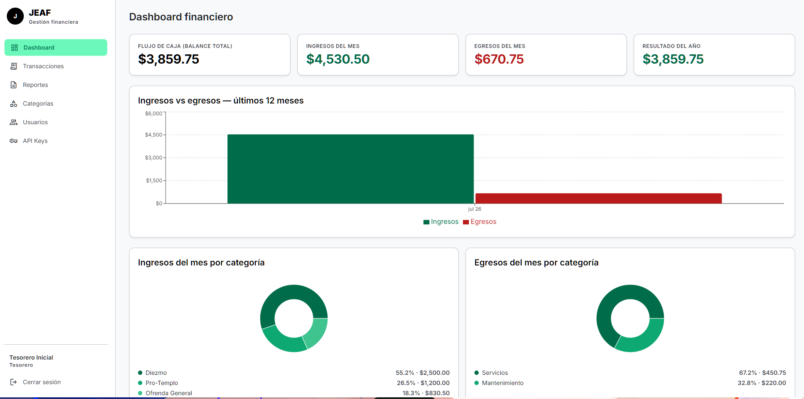
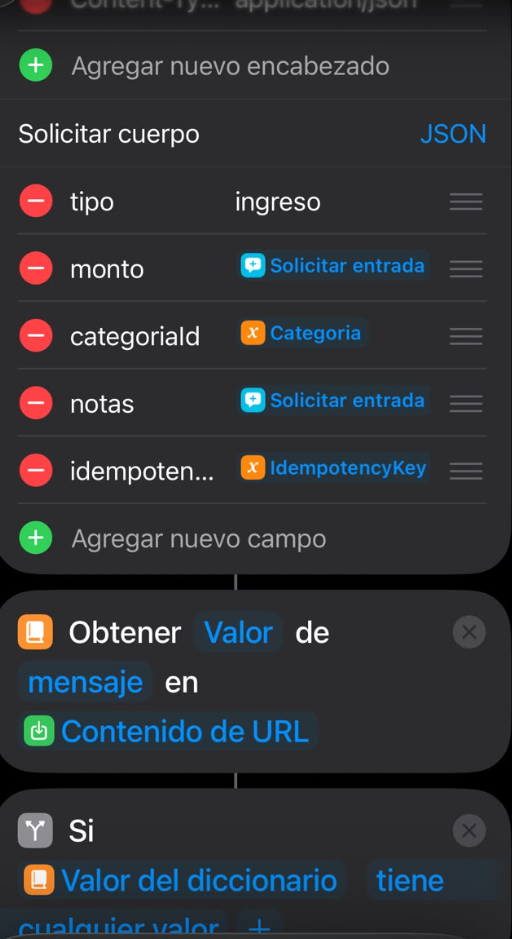
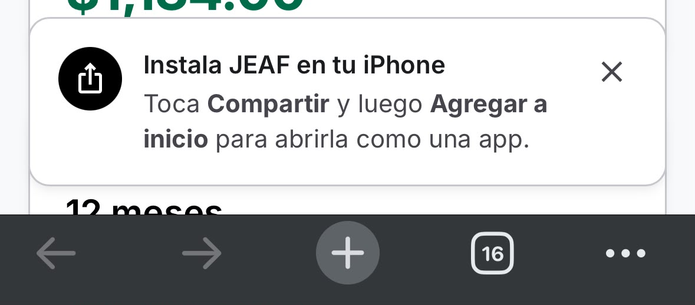
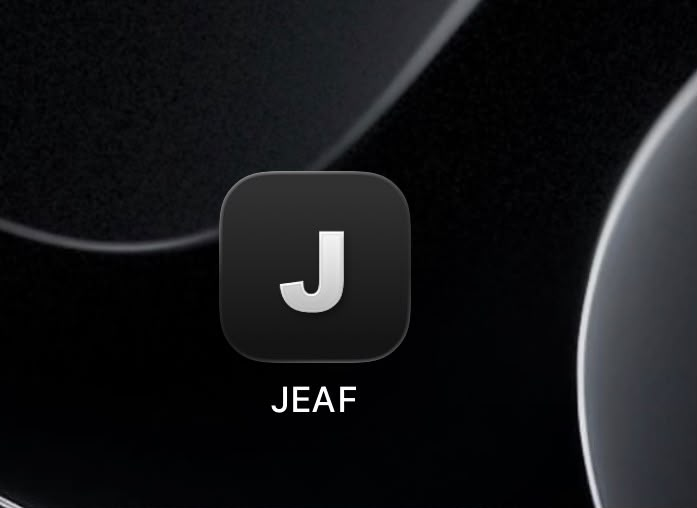

# JEAF — Plataforma de Gestión Financiera y Contable para Iglesias

Sistema transaccional interno single-tenant para automatizar el registro, control y auditoría de ingresos (ofrendas, diezmos, donaciones) y gastos. Basado en la especificación **JEAF v1.2** ([docs/JEAF_Especificacion_v1_2.docx](docs/JEAF_Especificacion_v1_2.docx)).

## Capturas

| Panel web — Dashboard financiero | Captura móvil — Atajo de iOS |
|---|---|
|  |  |

| PWA — Aviso de instalación en iOS | PWA — Icono en la pantalla de inicio |
|---|---|
|  |  |

## Arquitectura

| Capa | Tecnología |
|------|-----------|
| Captura móvil | Atajos de iOS (HTTP POST + API Key) |
| Panel web | React + TypeScript + Vite + Tailwind CSS (PWA instalable, enfocada en iOS) |
| Backend | Node.js + Express.js (Clean Architecture) |
| Base de datos | MySQL 8 (ACID, `DECIMAL(12,2)`, UUIDs, UTC) |
| Auth | JWT (panel web) + API Keys hasheadas (Atajos iOS) |

## Estructura del repositorio

```
JEAF/
├── Backend/    → API REST (ver Backend/CHANGELOG.md)
├── Frontend/   → Panel administrativo SPA (ver Frontend/CHANGELOG.md) — inicia en FASE 2
└── docs/       → Especificación del proyecto
```

## Fases de desarrollo

| Fase | Nombre | Estado |
|------|--------|--------|
| FASE 0 | Arquitectura y Base de Datos | ✅ Completada |
| FASE 1 | Motor de Transacciones e iOS | ✅ Completada |
| FASE 2 | Panel Administrativo Web | ✅ Completada |
| FASE 3 | Cierres y Reportes Legales | ✅ Completada |
| FASE 4 | QA, Despliegue y Producción | ✅ Completada (pendiente UAT y despliegue efectivo) |

## Backend — arranque rápido

```bash
cd Backend
npm install
cp .env.example .env       # completar credenciales MySQL y secretos JWT
# Crear la base de datos y aplicar esquema + seed:
mysql -u root -p < database/schema.sql
mysql -u root -p < database/seed.sql
npm run dev
```

La API queda disponible en `http://localhost:3000/api/v1` (health check: `GET /api/v1/health`).

## Frontend — arranque rápido

```bash
cd Frontend
npm install
cp .env.example .env       # apuntar VITE_API_URL al backend
npm run dev                # panel en http://localhost:5173
```

Guía de captura móvil: [docs/Guia_Atajos_iOS.md](docs/Guia_Atajos_iOS.md).

El panel es una **PWA instalable**: desde Safari en iPhone/iPad, tocar **Compartir → Agregar a inicio** la abre como una app (sin la barra de Safari, con su propio icono). El aviso con estos pasos aparece automáticamente en iOS mientras no esté instalada.

## Documentación

| Documento | Contenido |
|-----------|-----------|
| [docs/Guia_Atajos_iOS.md](docs/Guia_Atajos_iOS.md) | Configuración de los Atajos de iOS de los capturistas |
| [docs/Manual_Tesorero.md](docs/Manual_Tesorero.md) | Operación diaria, cierre mensual y administración |
| [docs/Despliegue.md](docs/Despliegue.md) | Entornos, Render + Vercel + Aiven, CI/CD y backups |
| [docs/Diagrama_ER.md](docs/Diagrama_ER.md) | Mapa relacional de la base de datos (Mermaid) |
| [docs/JEAF.postman_collection.json](docs/JEAF.postman_collection.json) | Colección Postman para probar la API sin el teléfono |
| `http://localhost:3000/api/docs` | Swagger/OpenAPI interactivo (con el backend corriendo) |

## Pruebas

```bash
cd Backend
npm test          # unitarias (services, con mocks)
npm run test:int  # integración (repositories contra MySQL real jeaf_test)
npm run test:all  # ambas
```
