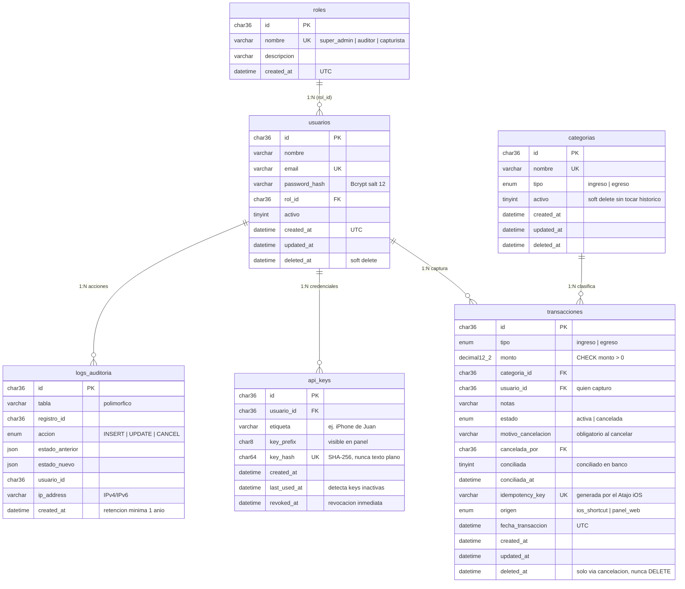

# JEAF — Diagrama Entidad-Relación

Mapa relacional de la base de datos (spec 9.1). Renderizable en GitHub/VS Code (Mermaid).

## Reglas estructurales

- **IDs**: UUID `CHAR(36)` en todas las tablas (evita predicción de registros).
- **Dinero**: `DECIMAL(12,2)` — nunca flotantes.
- **Fechas**: `DATETIME` en UTC; la conversión a hora local se centraliza en el backend.
- **Inmutabilidad**: prohibido `DELETE` físico en `transacciones`; `logs_auditoria` es solo-inserción.
- **`logs_auditoria` es polimórfica**: no tiene FK a la tabla auditada; referencia por (`tabla`, `registro_id`).
